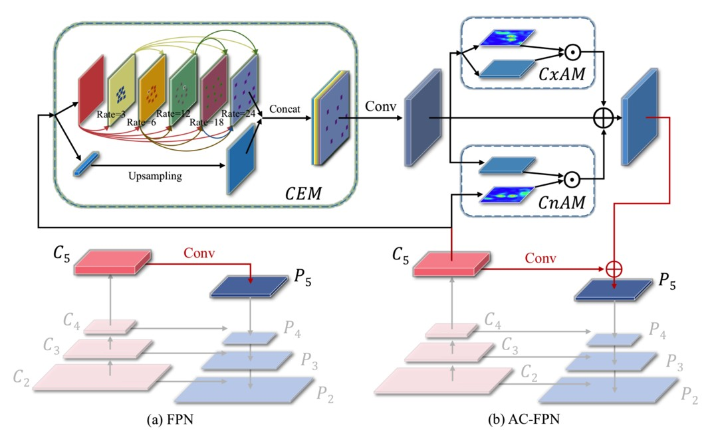
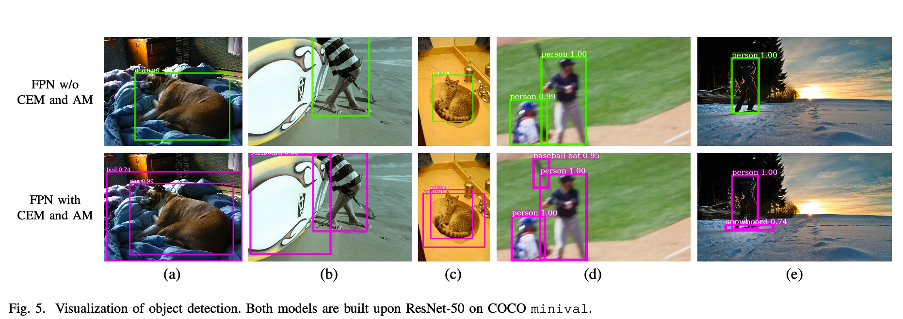
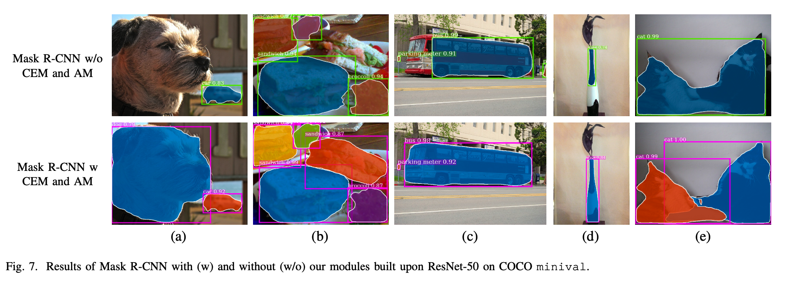
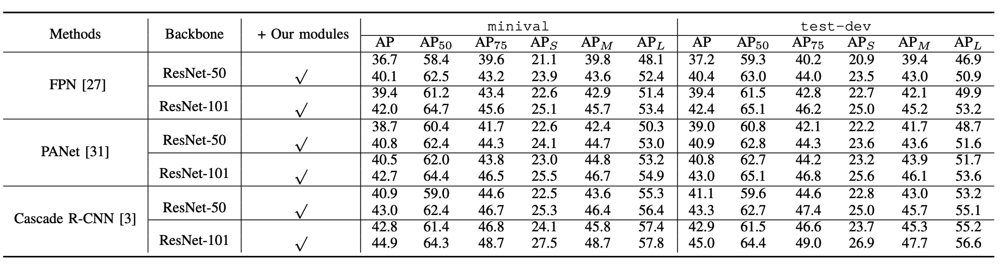
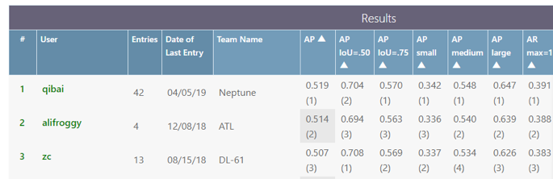

# Attention-guided Context Feature Pyramid Network for Object Detection

This repository re-implements [AC-FPN](https://arxiv.org/abs/2005.11475) on the base of [Detectron-Cascade-RCNN](https://github.com/zhaoweicai/Detectron-Cascade-RCNN). Please follow [Detectron](https://github.com/facebookresearch/Detectron) on how to install and use this repo.

This repo has **released [CEM module](https://github.com/Caojunxu/AC-FPN/blob/master/detectron/modeling/FPN.py) without AM module**, but we can get **higher performance** than the implementation of pytorch in paper. 
Also, thanks to the power of detectron, this repo is faster in training and inference.

The **implementation of CEM is very simple**, which is less than 200 lines code, but it can **boost the performance almost 3% AP** in FPN(resnet50).

## AC-FPN

AC-FPN can be readily plugged into existing FPN-based models and improve performance. 


Visualization of object detection. Both models are built upon ResNet-50 on COCO minival.
 

Results of Mask R-CNN with (w) and without (w/o) our modules built upon ResNet-50 on COCO minival.
 

More detail in [paper](https://arxiv.org/abs/2005.11475).

## Benchmarking

Because of the proposed architecture, We have better performance on most of FPN-base methods, especially on large objects.
 

The result of coco test-dev(team Neptune).
 

### Mask R-CNN with Bells & Whistles
<table><tbody>
<!-- START BELLS TABLE -->
<!-- TABLE HEADER -->
<!-- Info: we use wrap text in <sup><sub></sub><sup> to make is small -->
<th valign="bottom"><sup><sub>&nbsp;&nbsp;&nbsp;&nbsp;&nbsp;&nbsp;&nbsp;&nbsp;backbone&nbsp;&nbsp;&nbsp;&nbsp;&nbsp;&nbsp;&nbsp;&nbsp;</sub></sup></th>
<th valign="bottom"><sup><sub>type</sub></sup></th>
<th valign="bottom"><sup><sub>lr<br/>schd</sub></sup></th>
<th valign="bottom"><sup><sub>im/<br/>gpu</sub></sup></th>
<th valign="bottom"><sup><sub>box<br/>AP</sub></sup></th>
<th valign="bottom"><sup><sub>box<br/>AP50</sub></sup></th>
<th valign="bottom"><sup><sub>box<br/>AP75</sub></sup></th>
<!-- TABLE BODY -->
<tr>
<td align="left"><sup><sub>X-152-32x8d-FPN-IN5k-baseline</sub></sup></td>
<td align="left"><sup><sub>Mask</sub></sup></td>
<td align="left"><sup><sub>s1x</sub></sup></td>
<td align="right"><sup><sub>1</sub></sup></td>
<td align="right"><sup><sub>48.1</sub></sup></td>
<td align="right"><sup><sub>68.3</sub></sup></td>
<td align="right"><sup><sub>52.9</sub></sup></td>
</tr>
<tr>
<td align="left"><sup><sub>X-152-32x8d-FPN-IN5k-cascade</sub></sup></td>
<td align="left"><sup><sub>Mask</sub></sup></td>
<td align="left"><sup><sub>s1x</sub></sup></td>
<td align="right"><sup><sub>1</sub></sup></td>
<td align="right"><sup><sub>50.2</sub></sup></td>
<td align="right"><sup><sub>68.2</sub></sup></td>
<td align="right"><sup><sub>55.0</sub></sup></td>
</tr>
<tr>
<td align="left"><sup><sub>X-152-32x8d-FPN-IN5k-acfpn(only CEM)</sub></sup></td>
<td align="left"><sup><sub>Mask</sub></sup></td>
<td align="left"><sup><sub>s1x</sub></sup></td>
<td align="right"><sup><sub>1</sub></sup></td>
<td align="right"><sup><sub>51.9</sub></sup></td>
<td align="right"><sup><sub>70.4</sub></sup></td>
<td align="right"><sup><sub>57.0</sub></sup></td>
</tr>
<!-- END BELLS TABLE -->
</tbody></table>


## Citation

If you use our code/model/data, please site our paper:

```
@article{cao2020attention,
  title={Attention-guided Context Feature Pyramid Network for Object Detection},
  author={Cao, Junxu and Chen, Qi and Guo, Jun and Shi, Ruichao},
  journal={arXiv},
  pages={arXiv--2005},
  year={2020}
}
```
and Cascadercnn:
```
@inproceedings{cai18cascadercnn,
  author = {Zhaowei Cai and Nuno Vasconcelos},
  Title = {Cascade R-CNN: Delving into High Quality Object Detection},
  booktitle = {CVPR},
  Year  = {2018}
}
```

and Detectron:

```
@misc{Detectron2018,
  author =       {Ross Girshick and Ilija Radosavovic and Georgia Gkioxari and
                  Piotr Doll\'{a}r and Kaiming He},
  title =        {Detectron},
  howpublished = {\url{https://github.com/facebookresearch/detectron}},
  year =         {2018}
}
```
